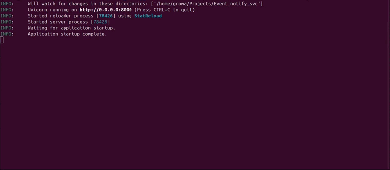
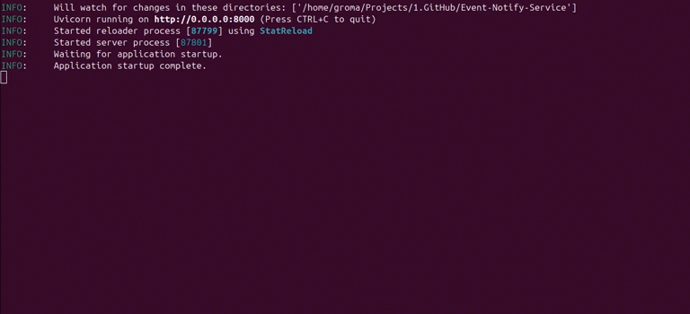

# Event Notify Service

Простой сервис, который принимает события (задачи, встречи, сообщения), сохраняет их в памяти, формирует текст уведомления через Ollama и пишет результат в лог. Если Ollama недоступна - используется короткий шаблонный текст по типу события.

###  Демонстрация c llm:



###  Демонстрация без llm:


## Структура проекта

```text
Event_notify_svc/
├── app/
│   ├── main.py                      # точка входа FastAPI: app, lifespan, ошибки
│   ├── deps.py                      # зависимости FastAPI (сервисы/хранилище)
│   ├── models.py                    # Pydantic-модели запросов/ответов и типы событий
│   ├── store.py                     # in-memory хранилище событий и уведомлений
│   ├── routers/
│   │   └── events.py                # API-ручки: /event, /events, /events/random
│   ├── service/
│   │   ├── event_svc.py             # обработка события, дедупликация, сохранение
│   │   └── notification_svc.py      # генерация уведомления через Ollama + fallback
│   └── config/
│       ├── config.py                # настройки из .env
│       └── prompts.py               # промпт для LLM
├── data/
│   └── events.json                  # шаблоны событий для /events/random
├── .env.example                     # пример переменных окружения
├── pyproject.toml                   # метаданные проекта и зависимости
└── requirements.txt                 # зависимости для установки через pip
```

## Быстрый старт

Нужен **Python 3.12+**: [скачать Python](https://www.python.org/downloads/).

### Вариант 1 (рекомендуется): uv

```bash
# установить uv
# Linux/macOS: curl -LsSf https://astral.sh/uv/install.sh | sh
# Windows PowerShell: irm https://astral.sh/uv/install.ps1 | iex

uv sync
uv run uvicorn app.main:app --reload --host 0.0.0.0 --port 8000
```

### Вариант 2: pip + venv

```bash
python -m venv .venv
# Linux/macOS: source .venv/bin/activate
# Windows cmd:  .venv\Scripts\activate.bat
# Windows PS:   .venv\Scripts\Activate.ps1
pip install -r requirements.txt
uvicorn app.main:app --reload --host 0.0.0.0 --port 8000
```

### Запуск Ollama

**Ollama (опционально):** [ollama.com](https://ollama.com/) - для генерации текста. Подтяните модель, например: ollama pull llama3.1.

```bash
# 1) скачать модель
ollama pull llama3.1

# 2) запустить сервер Ollama (по умолчанию http://localhost:11434)
ollama serve
```

Проверка, что Ollama принимает запросы:

```bash
curl http://localhost:11434/api/tags
```

Если API поднят, вернётся JSON со списком моделей.

### Настройки

Скопируйте в .env и отредактируйте:

```bash
cp .env.example .env
```

Если .env нет, используются значения по умолчанию из списка ниже.

- OLLAMA_URL - адрес Ollama
- OLLAMA_MODEL - модель
- LLM_TIMEOUT_SECONDS - таймаут запроса к Ollama (сек)
- OLLAMA_TEMPERATURE - температура генерации
- OLLAMA_NUM_PREDICT - ограничение длины ответа
- PATH_EVENT- JSON с шаблонами для POST /events/random

## Запуск

Порядок запуска:

1. Если нужен LLM-режим - поднимите Ollama (`ollama serve`).
2. Запустите API одним из вариантов ниже.
3. Откройте Swagger и проверьте ручки.

С uv:

```bash
uv run uvicorn app.main:app --reload --host 0.0.0.0 --port 8000
```

После pip install (в активированном venv):

```bash
uvicorn app.main:app --reload --host 0.0.0.0 --port 8000
```

Документация (Swagger): [http://127.0.0.1:8000/docs](http://127.0.0.1:8000/docs)

## Тесты

Запуск всех тестов :

```bash
# через uv
uv run python -m unittest tests.test_api

# без uv
python -m unittest tests.test_api
```

## API

- POST /event - принять событие: проверка -> сохранение (без дублей по event_id) -> уведомление -> лог
- GET /events - список сохранённых событий
- POST /events/random - взять случайный шаблон из PATH_EVENT и прогнать тот же пайплайн, что и для POST /event

**Пример POST /event:**

```json
{
  "event_id": "3fa85f64-5717-4562-b3fc-2c963f66afa6",
  "user_id": "123",
  "type": "task_created",
  "payload": {
    "title": "сделать отчёт",
    "description": "до пятницы"
  }
}
```

**Пример POST /events/random:**

```bash
curl -X POST http://127.0.0.1:8000/events/random
```

Пример ответа:

```json
{
  "status": "accepted",
  "event_id": "8f8f9a46-93ba-41b7-9797-e5e24c1f9951",
  "detail": "Событие обработано успешно."
}
```

**Пример ответа при дубликате event_id:**

```json
{
  "status": "duplicate",
  "event_id": "3fa85f64-5717-4562-b3fc-2c963f66afa6",
  "detail": "Событие уже было обработано ранее."
}
```

Типы: task_created, message_received. Поля payload - см. app/models.py. Повтор того же event_id вернёт status: duplicate без повторной генерации.

## Архитектурные решения

- **Хранилище в памяти** - без БД: проще разворачивать и достаточно для демо; данные пропадают при перезапуске.
- **Ollama + шаблоны** - локальная LLM без внешних API-ключей; при сбое сети или Ollama сервис всё равно отвечает предсказуемым текстом.
- **Зависимости через app.state и роуты** - минимальная связка FastAPI без лишней инфраструктуры.
